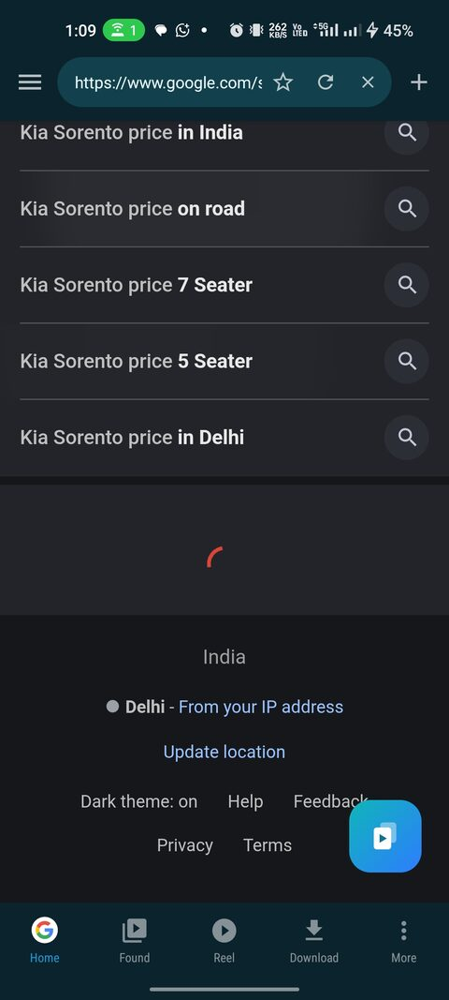
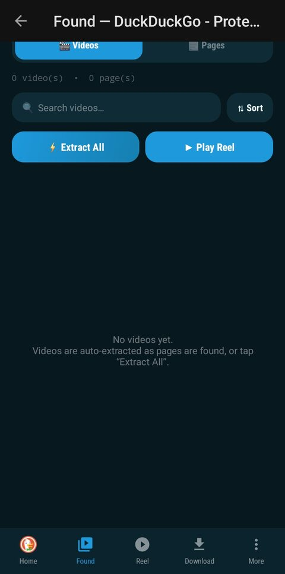
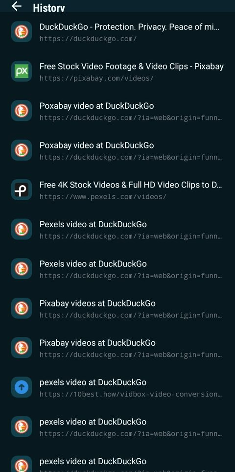
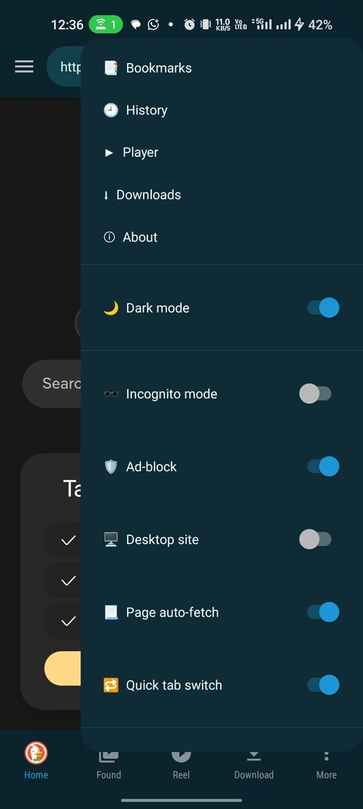

# Scrollr

**A video-first Android browser.** Browse, find every video on a page,
watch them as a swipeable reel, and save what you want.

---

## Scrollr is currently in closed testing

The app is not public yet. To install it you have to be on the tester list, and
**joining the Google Group is what puts you on it.**

> ### Two steps, in this order
>
> **1. Join the group → <https://groups.google.com/g/scrollr>**
> Click **Join group**. Use the same Google account you use on your phone's Play Store.
>
> **2. Then open the Play Store link → <https://play.google.com/store/apps/details?id=com.scrollr>**
> Install as normal.

If step 2 says the app **isn't available** or shows a 404, it is almost always one of these:

| What you see | What it means |
|---|---|
| "Item not found" / 404 | You opened the Play link before joining the group |
| Play shows a different account | Switch to the account that joined the group |
| Still not showing after joining | Google can take a little while to sync — give it up to a few hours |

---

## What it does

Most browsers treat video as just another element on the page. Scrollr treats it as
the point. It watches every page you open, collects the videos it finds, and gives you
somewhere to actually watch them.

| Browse | Found | Library | Options |
|:--:|:--:|:--:|:--:|
|  |  |  |  |

### Find videos automatically
Pages are scanned as you browse, and anything playable is collected into **Found** —
per tab, so results from different sites never mix. Streams that a page hides behind its
own player get resolved too. There is an **Extract All** button when you want to sweep a
listing page in one go, and a floating button that catches media the page loads quietly
in the background.

### Watch them as a reel
**Reel** turns everything a tab found into a vertical, swipeable feed. Videos buffer
ahead so swiping is instant.

- **Hold anywhere** on the video for 2× speed, release to go back to normal
- **Double-tap** the left or right side to jump 10 seconds
- **Skip watched** hides anything you've already seen
- **Shuffle all tabs** mixes every tab's finds into one feed
- **Quality**: Auto, High (1080p), Standard (720p), or Data saver — a ceiling, never a
  demand, so a video that only exists in 4K still plays on Data saver

### Download and keep
Save direct MP4, HLS and DASH streams, with a quality picker when a stream offers several.
The downloader splits a file across **up to 32 parallel parts**, so large videos come down
fast, and it keeps running in the background.

### An offline reel too
Downloads get their own vertical swipe feed, exactly like the online one — so everything
you've saved is watchable in the same way, with no other app involved.

### Block ads properly
A full Adblock Plus / uBlock-style network engine, not a host blocklist — resource types,
first vs. third party, exception rules and per-site scoping are all honoured. It runs
**114,000+ active rules** from EasyList, EasyPrivacy, AdGuard Mobile, Fanboy and malware
lists, and you can see exactly what is loaded under **Settings ▸ Ad-block filters**.

### Browse the way you want
- **Tabs**, with a separate incognito space that keeps nothing when you leave it
- **Search engine per mode** — 10 presets, or paste any search URL. Normal and incognito
  keep their own, so choosing Google for browsing doesn't drag it into incognito
- **Bookmarks and history**, swipe to delete with undo
- **Dark and light**, plus an AMOLED-black incognito look
- Desktop site, HTTPS-only, find in page, clear on exit, quick tab switch

---

## Privacy

- **No account. No sign-up. No analytics, no tracking, no telemetry.**
- Bookmarks, history, downloads and settings stay on your device.
- Incognito keeps a completely separate tab space and discards it on exit.
- Crash reports are written to a **local file** you can read under
  **Settings ▸ Crash log** — nothing is ever sent anywhere.

---

## Requirements

| | |
|---|---|
| Android | 8.0 (Oreo) or newer |
| Device | 64-bit (arm64) — effectively every phone since ~2019 |
| Size | ~65 MB installed |

---

## Reporting a bug

Please [open an issue](https://github.com/HelpersforEverybody/scrollr/issues) with:

1. What you did and what happened instead
2. Your Android version and phone model
3. **If it crashed:** open **Settings ▸ Crash log**, tap **Copy all**, and paste it in.
   That single step turns a guess into a fix.

Feedback and feature requests are welcome in the [testers group](https://groups.google.com/g/scrollr) too.

---

**[Join the group](https://groups.google.com/g/scrollr)** → **[Install from Play](https://play.google.com/store/apps/details?id=com.scrollr)**

This repository is the app's home page and issue tracker. The source code is not published here.

