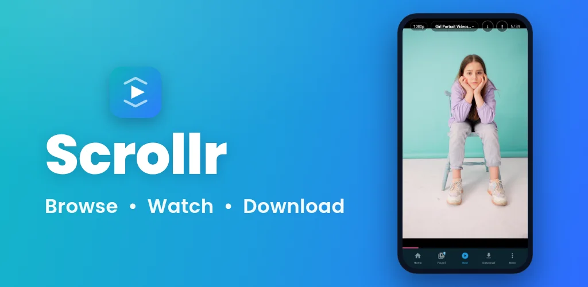
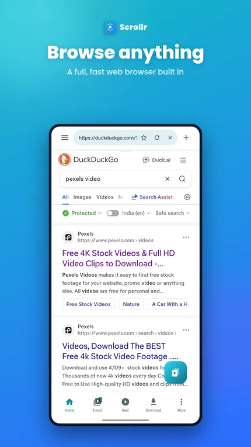
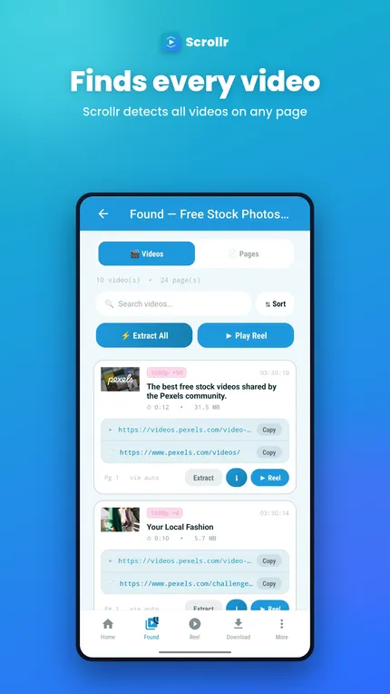
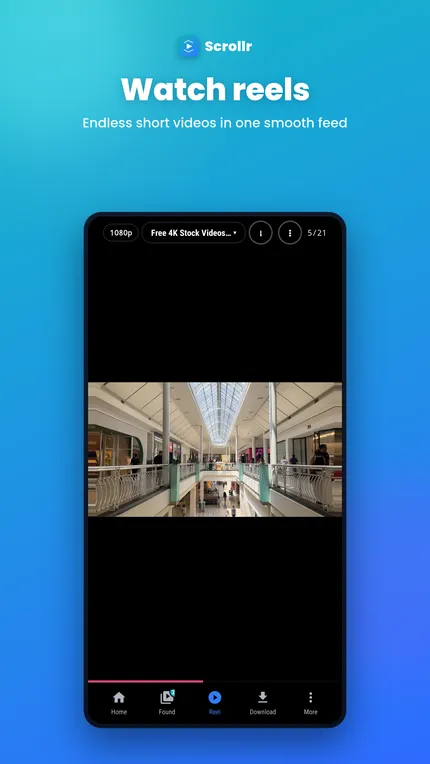
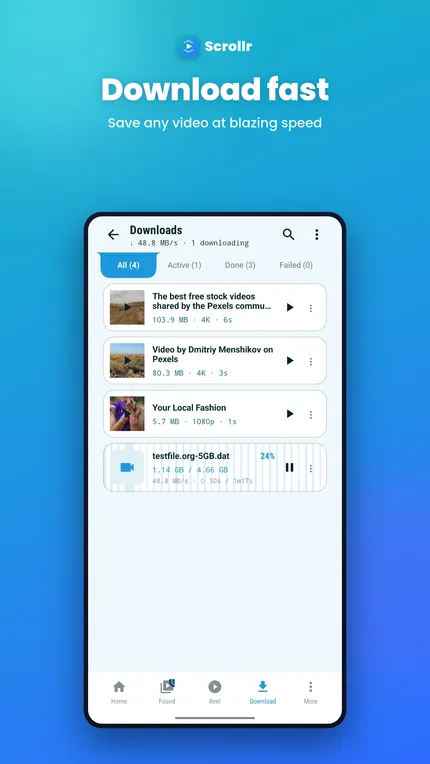
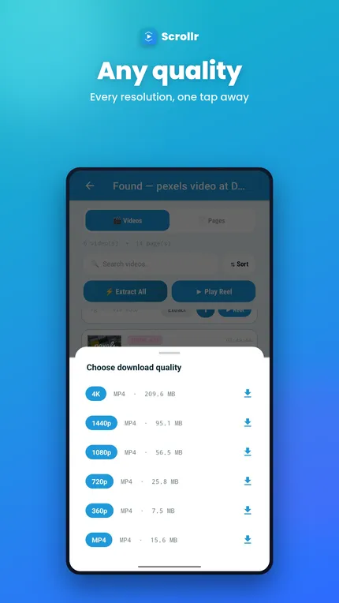
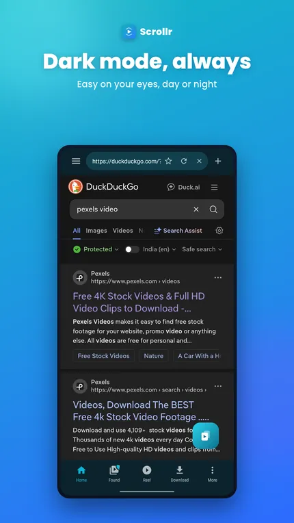
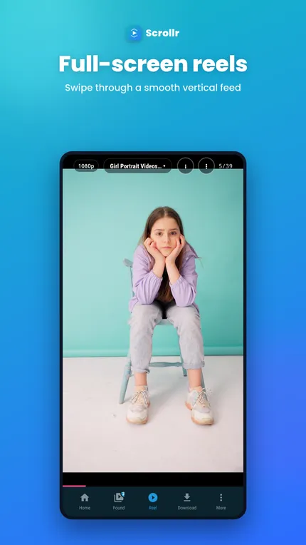
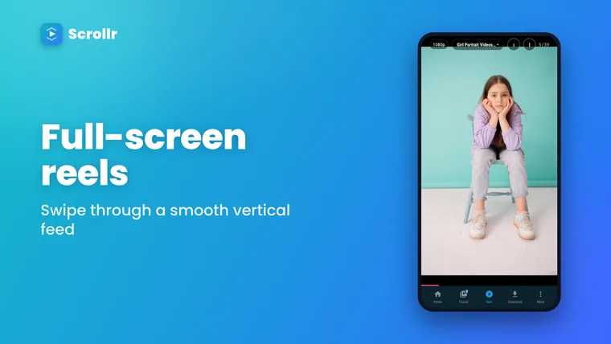
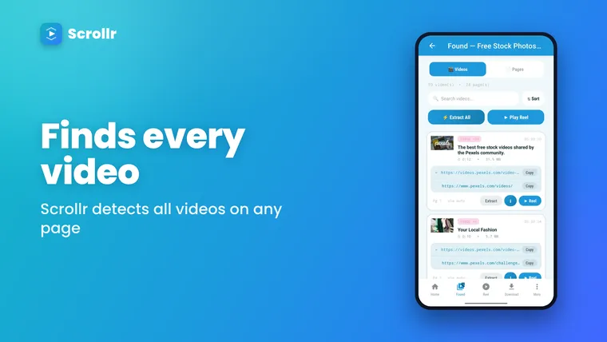

# Scrollr

**A video-first Android browser.** Browse any site, find every video on the page,
watch them as a swipeable reel, and download what you want.

---

## Scrollr is in closed testing

The app isn't public yet. To install it you have to be on the tester list, and
**joining the Google Group is what puts you on it.**

> ### Two steps, in this order
>
> **1 — Join the group:** <https://groups.google.com/g/scrollr>
> Click **Join group**, using the same Google account your phone's Play Store uses.
>
> **2 — Then open Play:** <https://play.google.com/store/apps/details?id=com.scrollr>
> Install as normal.

If Play says the app isn't available, it's almost always one of these:

| What you see | What it means |
|---|---|
| "Item not found" / 404 | You opened the Play link before joining the group |
| Play is on a different account | Switch to the account that joined the group |
| Still missing after joining | Google can take a while to sync — give it a few hours |

---

## A look at it

---

## What it does

Most browsers treat video as just another element on the page. Scrollr treats it as
the point.

### Finds every video, by itself
Pages are scanned as you browse and anything playable lands in **Found** — kept per tab,
so results from different sites never mix. Streams a page hides behind its own player get
resolved too. **Extract All** sweeps a whole listing page at once, and a floating button
catches media the page loads quietly in the background.

### Watch them as a reel

**Reel** turns a tab's finds into a full-screen vertical feed that buffers ahead, so
swiping is instant.

- **Hold anywhere** for 2× speed — release to go back to normal
- **Double-tap** either side to jump 10 seconds
- **Skip watched** hides anything you've already seen
- **Shuffle all tabs** mixes every tab's finds into one feed
- **Quality**: Auto, High (1080p), Standard (720p) or Data saver — a ceiling, never a
  demand, so a video that only exists in 4K still plays on Data saver

 

### Download fast, watch offline
Save direct MP4, HLS and DASH streams, choosing the resolution when a video offers
several. The downloader splits each file across **up to 32 parallel parts**, so large
videos come down quickly, and it keeps going in the background.

Your downloads then get **their own vertical reel** — everything you've saved is
watchable the same way, with no other app involved.

### Blocks ads properly
A full Adblock Plus / uBlock-style network engine, not just a host blocklist: resource
types, first vs. third party, exception rules and per-site scoping are all honoured. It
runs **114,000+ active rules** from EasyList, EasyPrivacy, AdGuard Mobile, Fanboy and
malware lists, and you can see exactly what's loaded under **Settings ▸ Ad-block filters**.

### Browse the way you want
- **Tabs**, with a separate incognito space that keeps nothing when you leave it
- **Search engine per mode** — 10 presets or any search URL you paste. Normal and
  incognito keep their own, so choosing Google for browsing doesn't drag it into incognito
- **Bookmarks and history**, swipe to delete with undo
- **Dark and light**, plus an AMOLED-black incognito look
- Desktop site, HTTPS-only, find in page, clear on exit, quick tab switch

### Built for tablets too

---

## Privacy

- **No account, no sign-up, no analytics, no tracking, no telemetry.**
- Bookmarks, history, downloads and settings never leave your device.
- Incognito keeps a completely separate tab space and discards it on exit.
- Crash reports are written to a **local file** you can read under
  **Settings ▸ Crash log** — nothing is ever sent anywhere.

---

## Requirements

| | |
|---|---|
| Android | 8.0 (Oreo) or newer |
| Device | 64-bit (arm64) — effectively every phone since ~2019 |
| Size | ~65 MB installed |

---

## Found a bug?

[Open an issue](https://github.com/HelpersforEverybody/scrollr/issues) with:

1. What you did, and what happened instead
2. Your Android version and phone model
3. **If it crashed:** open **Settings ▸ Crash log**, tap **Copy all**, and paste it in —
   that one step turns a guess into a fix

Feedback and feature requests are welcome in the
[testers group](https://groups.google.com/g/scrollr) too.

---

**[Join the group](https://groups.google.com/g/scrollr)** → **[Install from Play](https://play.google.com/store/apps/details?id=com.scrollr)**

This repository is the app's home page and issue tracker. The source code isn't published here.

